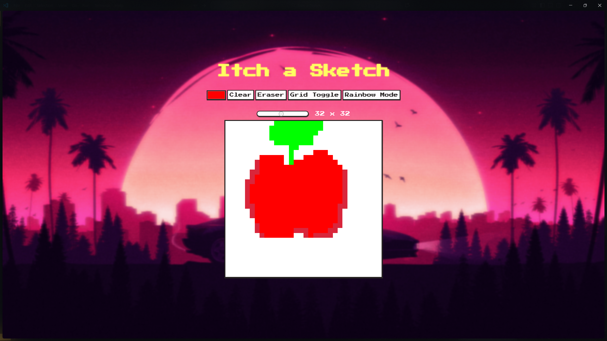

# 🎨 Etch-a-Sketch

Remember that classic red drawing toy? This is its digital cousin!

A simple, browser-based "Etch-a-Sketch" where you can unleash your inner artist (or just scribble for a bit).

## How it Works

- **Magic Screen:** A grid of pixels is ready for your masterpiece.
- **Hover-to-Draw:** Just move your mouse over the squares to draw. No shaking required to erase (just refresh the page... for now 😉).

## Built With

This project was brought to life using the classic web trio:

- **HTML** (The skeleton)
- **CSS** (The cool outfit)
- **JavaScript** (The magic that makes it work)
